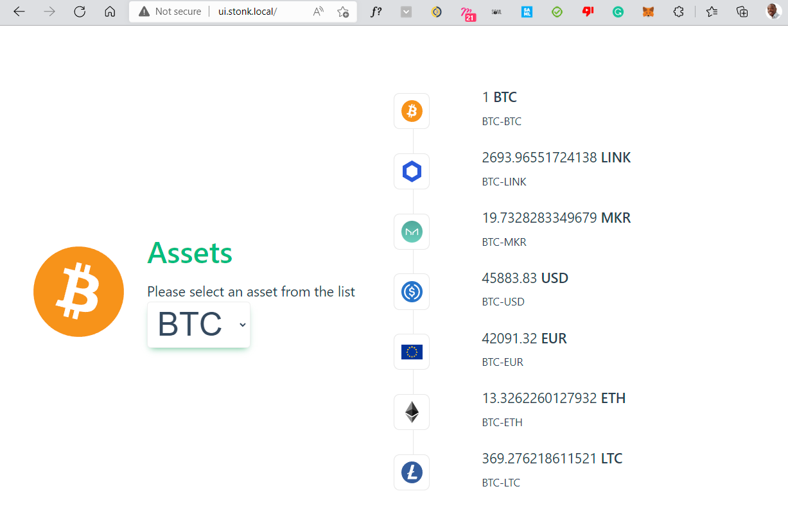

# Stonk Project

## Dependencies
- [Docker](https://www.digitalocean.com/community/tutorials/how-to-install-and-use-docker-on-ubuntu-20-04)
- [Docker-Compose](https://www.digitalocean.com/community/tutorials/how-to-install-docker-compose-on-ubuntu-18-04)
- Make - `sudo apt-get install build-essential`

## First time setup

1. Create necessary docker networks:
```bash
docker network create nginx_proxy
```
2. Run [nginx proxy](https://github.com/nginx-proxy/nginx-proxy)
```bash
# note: --restart=always restarts the container automatically after reboots
docker run -d -p 80:80 --name=nginx-reverse-proxy --network=nginx_proxy --restart=always -v /var/run/docker.sock:/tmp/docker.sock:ro jwilder/nginx-proxy
```
3. Setup `VIRTUAL_HOST` entries in you hosts file
```
# on Linux - /etc/hosts
# on Windows - C:\Windows\System32\drivers\etc

host$ > sudo nano /etc/hosts

# - Add the following line to your `hosts` files
127.0.0.1       api.stonk.local
127.0.0.1       ui.stonk.local
```

## General usage

### Project
* Create a copy of `secret.yml.example` and rename it to `secret.yml`
* Please confirm that `ui/src/main.js => API_HOST` points to the same api host.
* Run `make build`
  * The image is built and stored locally
* Run `make run`
  * Starts up all the services defined in the `docker-compose` files and keeps the process open in the current terminal
  * Running `make run-d` will start a detached process
  * Monitoring the logs can help debug startup issues or programming errors, either by not starting a detached process, or by tailing the STDOUT/STDERR with `make run logs`
```
host$ > make run

# or

host$ > make run-d
```
* Refer to the content of the `Makefile` for other useful commands


## Finally
After configuring your VIRTUAL_HOST, and running `make build && make run` in the root folder of the project.

Backend app will be accessible on http://api.stonk.local or http://localhost:8080

Frontend UI will be accessible on http://ui.stonk.local or http://localhost:3000

To test that it is working go to `[HOST]/health`

---

# Usage
Please checkout `api/example.http` for all the endpoints required in this exercise.

To use the `api/example.http` file on VSCode, please install the [Rest Client (humao.rest-client)](https://marketplace.visualstudio.com/items?itemName=humao.rest-client) extension.

I opted to use `UUID` instead of `integer` as a `id` reference for `[Assets and AssetPrices]`


## Extra
### Connecting to containers
* Run `make connect service=<service>`
  *  The `service` must be the name defined in the docker-compose files, e.g. `api` or `database`.
* To test the `api`
  * Connect to the running service 
  * Run the `test` yarn command in the `api` container
  ```
  # from project-root directory
  
  host $ make connect service=api
  /app # yarn run migration:run
  /app # yarn run test
  ```

## Things currently
- API - Asset Auto Populate
- API - Scheduler refresh of prices
- API - Enpoints to supply Assets and Prices
- API - Caching of Prices in DB
- UI - Asset Toogle and Preview
- UI - Price Preview based on selected Asset
- UI - Auto refresh on WebSocket update
## Things to improve on
- Allow Multiselect of Assets in Frontend
- Add Frontent UI Tests, using Cypress and/or VueTest
- Tailored Websocket message to UI clients
- E2E Tests for AssetPrices
- Authentication of `Users`
- Authorization of `Users`
- Full CRUD for all Major Entities [`Assets`, `AssetPrices`]
  - currently:
    - `Assets` [Create, Read]
    - `AssetPrices` [Read]
- Add Linting Fix with ESLint
- Script to inject API_HOST into UI .env file
- Configure testing through `make test` using proper `docker-compose.test.yml`
- Unit test for the `AssetPricesService -> syncAndUpdateAssetPrices(...)`
- Clean up missed boilerplate code
- Add more inline documentation